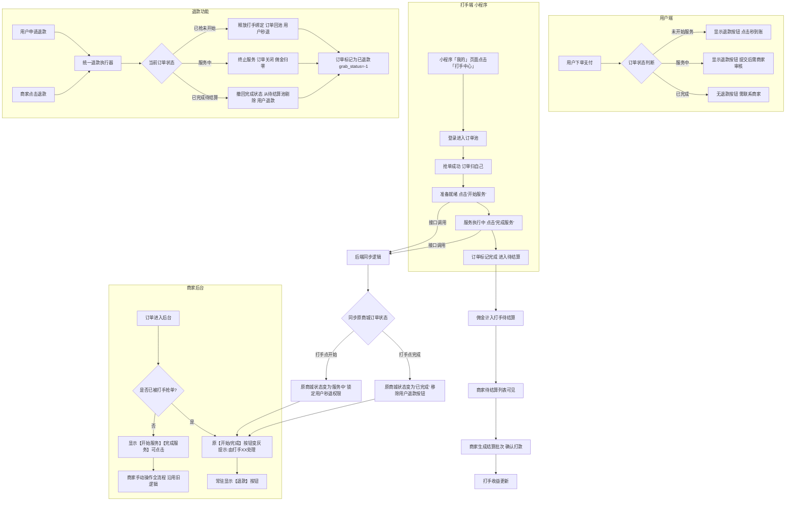

# 产品需求文档（PRD）
## 游戏打手抢单结算系统 V1.0（终版）

| 文档版本 | 修订日期       | 修订说明                        |
| :--- | :--------- | :-------------------------- |
| V1.0 | 2026-07-10 | 终版，基于第一性原理精简退款逻辑，合并为统一退款执行器 |


## 1. 项目背景与核心原则

- **业务场景**：用户在小程序下单购买游戏服务（代练/陪玩），订单进入后台。商家员工（打手）抢单并执行服务。
- **核心原则（第一性）**：

  1. **谁执行，谁操作**：打手抢单后，「开始服务」和「完成服务」由打手在小程序端触发，原商家后台对应按钮灰显。
  2. **商家保留最终退款权**：无论订单处于什么状态，商家后台必须有一个【退款】按钮，用于处理纠纷退钱。
  3. **小程序不提现**：所有资金展示仅限于“已结算/待结算”，打款由商家线下完成并在后台确认。


## 2. 用户角色

| 角色 | 说明 |
| :--- | :--- |
| **C端用户** | 小程序下单购买游戏服务的普通用户 |
| **打手（员工）** | 注册并通过审核的游戏服务执行者，使用小程序端抢单/操作 |
| **商家（管理员）** | 使用商家后台（Web/小程序管理端），负责审核、退款、结算 |


## 3. 功能范围（V1.0）

| 模块       | 包含                        | 不包含         |
| :------- | :------------------------ | :---------- |
| 入口开关     | ✅ 商家后台控制小程序「我的」页面入口显隐     | —           |
| 注册/登录/审核 | ✅ 完整字段（仅删去「项目组」），审核通过方可登录 | —           |
| 订单池/抢单   | ✅ 列表展示 + 乐观锁防并发           | 自动分配、轮流分配   |
| 开始服务     | ✅ 打手触发，同步原商城状态            | —           |
| 完成服务     | ✅ 打手触发，同步原商城状态            | —           |
| 商家权限移交   | ✅ 原按钮灰显，控制权移交打手           | —           |
| 退款功能     | ✅ 用户申请退款 + 商家主动退款，统一执行器   | 复杂仲裁流程、多级审批 |
| 数据看板     | ✅ 4个核心数字 + 最近动态列表         | 趋势图、高级筛选    |
| 佣金结算     | ✅ 商家批量生成批次 + 确认打款         | 自动打款、员工申请提现 |
| 我的收益     | ✅ 汇总卡片 + 明细列表             | 账单导出、按时间筛选  |


## 4. 入口位置

- **小程序端**：**「我的」页面**（个人中心），在下方菜单列表中增加入口按钮。
- **按钮文案**：「打手中心」或「员工入口」。
- **显示逻辑**：受商家后台 `employee_entry_visible` 开关控制，开启则显示，关闭则隐藏（用于过审）。


## 5. 注册/登录/审核（完整版）

### 5.1 注册字段

| 分区       | 字段     | 输入类型      | 必填  | 说明         |
| :------- | :----- | :-------- | :-- | :--------- |
| **登录信息** | 手机号    | 文本输入      | ✅   | 格式校验       |
|          | 密码     | 文本（掩码）    | ✅   | 6位以上       |
|          | 邀请码    | 文本输入      | ✅   |            |
| **实名信息** | 性别     | 下拉选择（男/女） | ✅   |            |
|          | 手机号    | 文本输入      | ✅   | 手机号        |
|          | 身份证图片  | 文件上传（图片）  | ✅   | 需上传2张（0/2） |
|          | ZFB账号  | 文本输入      | ✅   | 收款支付宝      |
|          | 收款人姓名  | 文本输入      | ✅   | 真实姓名       |
| **协议**   | 《打手协议》 | 复选框       | ✅   | 必须勾选方可提交   |

### 5.2 登录校验逻辑

| 审核状态   | 登录结果                 |
| :----- | :------------------- |
| 待审核（0） | 提示“账号审核中，请耐心等待”，禁止登录 |
| 已通过（1） | 正常登录，进入订单池           |
| 已驳回（2） | 提示“审核未通过，请联系商家”，禁止登录 |


## 6. 完整订单状态机

```
状态流转路径（打手视角）：

待抢单 (grab_status=0)
   │
   ├── 打手点击【抢单】成功
   ▼
已抢待开始 (grab_status=1, service_status=0)
   │
   ├── 打手点击【开始服务】
   ▼
服务中 (grab_status=1, service_status=1)
   │
   ├── 打手点击【完成服务】
   ▼
已完成待结算 (grab_status=2, settle_status=0)
   │
   ├── 商家生成结算批次 → 确认打款
   ▼
已结算 (grab_status=2, settle_status=1)

异常终态：
已退款 (grab_status=-1, settle_status=-1)  ← 任何阶段均可通过退款功能进入
```


## 7. 权限移交矩阵

| 订单状态 | 打手端可操作 | 原商家后台「开始/完成」按钮 | 原商家后台「退款」按钮 | C端用户退款入口 |
| :--- | :--- | :--- | :--- | :--- |
| **待抢单** | 无 | ✅ 可点击（沿用旧逻辑） | 无（无需退款） | ✅ 显示（秒退） |
| **已抢待开始** | 【开始服务】 | ❌ 灰显，提示“打手XX已接单” | ✅ 常驻【退款】 | ✅ 显示（秒退） |
| **服务中** | 【完成服务】 | ❌ 灰显 | ✅ 常驻【退款】 | ✅ 显示（需商家审核） |
| **已完成待结算** | 无 | ❌ 灰显 | ✅ 常驻【退款】 | ❌ 无退款按钮 |
| **已结算** | 无 | ❌ 灰显 | 置灰，提示“已结算，请线下处理” | ❌ 无 |


## 8. 完整流程图




## 9. 退款功能详细说明

### 9.1 一句话定义

**退款 = 商家退钱给用户 + 系统自动处理打手佣金 + 订单进入终态。**

### 9.2 两种触发方式

| 触发方式 | 触发者 | 触发条件 |
| :--- | :--- | :--- |
| **用户申请退款** | C端用户 | 用户在订单详情点击「申请退款」（仅限「未开始」和「服务中」状态） |
| **商家主动退款** | 商家后台管理员 | 商家在订单详情点击【退款】按钮（所有已抢状态均可） |

> 两种方式最终调用**同一个底层退款执行器**。

### 9.3 退款执行器 - 按状态处理逻辑

| 当前状态       | 执行动作                                                                                                              |
| :--------- | :---------------------------------------------------------------------------------------------------------------- |
| **已抢未开始**  | ①释放打手绑定（`employee_id=null`）<br>②订单回池（`grab_status=0`）<br>③调用原商城秒退接口退款给用户                                          |
| **服务中**    | ①终止服务（`service_status=0`）<br>②订单彻底关闭（`grab_status=-1`）<br>③调用原商城“商家审核退款”接口退钱<br>④该笔打手佣金归零（从待结算池实时扣除）              |
| **已完成待结算** | ①撤回「已完成」状态（`grab_status=-1`）<br>②调用原商城后台强退接口退款<br>③从待结算池中剔除该笔（`settle_status=-1`）<br>④若已生成结算批次（待确认），自动从批次中移除并重算总额 |

### 9.4 数据一致性保障

| 数据项           | 退款后处理                                                                  |
| :------------ | :--------------------------------------------------------------------- |
| 订单状态          | `grab_status=-1`，`settle_status=-1`，记录 `refund_time` 和 `refund_reason` |
| 打手佣金          | 该笔 `commission` 归零，从待结算总额中实时扣除                                         |
| 商家看板「已完成订单数」  | 扣除该笔（`grab_status=-1` 不计入）                                             |
| 商家看板「待结算佣金总额」 | 重新 SUM（`settle_status=0`），自动刷新                                         |
| 结算批次（待确认状态）   | 自动剔除该订单，`total_amount` 重算                                              |


## 11. 接口清单（共18个）

| 模块  | 接口                              | Method | 说明                |
| :-- | :------------------------------ | :----- | :---------------- |
| 配置  | `/api/config/entry-toggle`      | POST   | 商家开关入口            |
| 配置  | `/api/config/entry-status`      | GET    | 小程序查询入口状态         |
| 员工  | `/api/employee/register`        | POST   | 注册（完整字段）          |
| 员工  | `/api/employee/audit-list`      | GET    | 待审核列表             |
| 员工  | `/api/employee/audit`           | POST   | 审核通过/驳回           |
| 员工  | `/api/employee/login`           | POST   | 登录（校验审核状态）        |
| 订单  | `/api/order/pool`               | GET    | 可抢订单列表            |
| 订单  | `/api/order/grab`               | POST   | 抢单（乐观锁）           |
| 订单  | `/api/order/my-grabs`           | GET    | 我的抢单列表            |
| 订单  | `/api/order/start`              | POST   | 打手开始服务            |
| 订单  | `/api/order/complete`           | POST   | 打手完成服务            |
| 退款  | `/api/refund/user-apply`        | POST   | 用户申请退款            |
| 退款  | `/api/refund/merchant-refund`   | POST   | 商家主动退款            |
| 退款  | `/api/refund/audit`             | POST   | 商家审核用户退款申请（通过/驳回） |
| 结算  | `/api/settlement/pending-list`  | GET    | 商家待结算列表           |
| 结算  | `/api/settlement/batch-create`  | POST   | 生成结算批次            |
| 结算  | `/api/settlement/batch-confirm` | POST   | 确认已打款             |
| 收益  | `/api/employee/earnings`        | GET    | 收益汇总+明细           |
|     |                                 |        |                   |


## 12. 非功能需求

- **过审策略**：`employee_entry_visible` 初始值 `false`，提交审核期间保持关闭，过审后商家自行开启。
- **权限隔离**：打手登录后仅能访问抢单/收益相关页面，不暴露商城购物功能。
- **并发抢单**：使用乐观锁：

```sql
UPDATE orders
SET grab_status = 1, employee_id = #{employeeId}, grab_time = NOW()
WHERE id = #{orderId} AND grab_status = 0;
```

- **数据看板**：直接查库实时统计，预估订单量 < 10万，无需缓存。

---

PRD 终版已完整输出，可直接进入开发排期。
